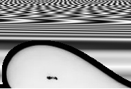
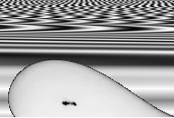

# Positional Image Generator (PositionalImageGenerator.py)

Small README for the positional encoding image utilities.

## Overview
This module generates sinusoidal positional encodings and applies them to experimental frame images to produce "positional-encoding" images used as additional input channels for models.

It supports:
- standard positional encoding (fixed-width)
- velocity-based encoding (width based on sequence length)
- cropping / masking to insert only the drop region into the PE image
- a "wide" full-scale mode for wide images

Source: [dataset/PositionalEncoding/PositionalImageGenerator.py](PositionalImageGenerator.py)

## Key functions and helpers
- [`dataset.PositionalEncoding.PositionalImageGenerator.sinusoidal_positional_encoding`](PositionalImageGeneratorPositionalImageGenerator.py)  
  Generate the base sinusoidal positional encoding matrix (shape: max_position × d_model).

- [`dataset.PositionalEncoding.PositionalImageGenerator.PE_Generator`](PositionalImageGeneratorPositionalImageGenerator.py)  
  Build a normalized PE image for a folder of frames. Supports velocity vs positional modes and optional resizing.
    

- [`dataset.PositionalEncoding.PositionalImageGenerator.cropped_position_encoding`](PositionalImageGeneratorPositionalImageGenerator.py)  
  Build and save a cropped positional encoding image (helper for visualization or specific crops).
      
  

- [`dataset.PositionalEncoding.PositionalImageGenerator.make_PE_image`](PositionalImageGeneratorPositionalImageGenerator.py)  
  Insert the drop pixels from a source image into the PE fill image using contour masking.

- [`dataset.PositionalEncoding.PositionalImageGenerator.make_PE_image_Folder`](PositionalImageGeneratorPositionalImageGenerator.py)  
  Process a folder of images using the detection CSV (`detections.csv`) and save PE-augmented images into the same folder (or `save_address`).

## Expected inputs and outputs
- Input folder: contains frame images (default extension `.png`) and a `detections.csv` with per-image indices (index, endpoint, beginning).
- Output: images written to `save_address` (default: same folder) where the positional encoding has the source drop pixels inserted into the PE background.
- PE image sizes: default produced with width 1245, configurable height (PE height must match chosen defaults).

## Typical usage
- Generate fixed positional encodings: call [`sinusoidal_positional_encoding`](PositionalImageGeneratorPositionalImageGenerator.py).
- For a folder of frames with `detections.csv`, run:
  - [`make_PE_image_Folder`](PositionalImageGeneratorPositionalImageGenerator.py) for standard folders.
  - [`make_PE_image_FolderFullScale`](PositionalImageGeneratorPositionalImageGenerator.py) for wide images.

NPhase patching helper uses these functions to batch-process datasets:
- [NPhase3_Patching.py](NPhase3_Patching.py) calls the folder functions to create PE images in parallel.

## Notes & safeguards
- `PE_Generator` asserts `PE_height == default_image_size[1]` to avoid cropping issues.
- `make_PE_image` raises when no contours are found; ensure `detections.csv` and frame images are correct.
- `make_PE_image_FolderFullScale` asserts that the path contains `'wide'` (case-insensitive).
- If `velocity_encoding` and `positional_encoding` are both True or both False, `PE_Generator` raises.

## Integration
- Downstream training and evaluation pipelines expect PE-augmented images in the usual frame folders (see dataset loaders in `dataset/` modules such as [dataset/MotherFolderDataset.py](dataset/MotherFolderDataset.py)).
- SI analysis and plotting scripts reference generated logs and results; see [`utils/SIData.py`](utils/SIData.py) for examples of how PE-augmented data is used in experiments.

## Files of interest
- Implementation: [dataset/PositionalEncoding/PositionalImageGenerator.py](PositionalImageGenerator.py)  
- Patching/parallel processing wrapper: [NPhase3_Patching.py](../../NPhase3_Patching.py)  
- Dataset loader integration: [dataset/MotherFolderDataset.py](../DaughterFolderDataset.py)  
- SI & analysis: [utils/SIData.py](../../utils/SIData.py)

## License
This project uses the repository license: see [LICENSE](../../LICENSE).
